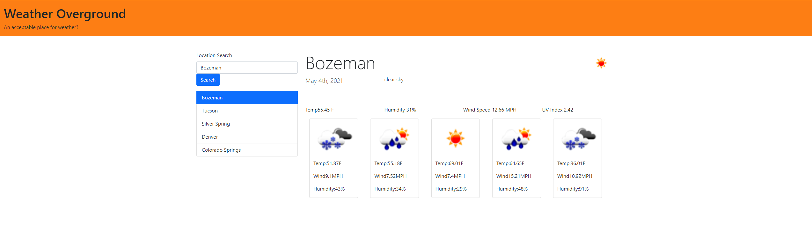

# weather-dashboard

## Description

This is a simple dektop app to diplay weather conditions in a city you search from a search bar. up to 5 past searches are stored locally to your device also for quick acess to weather in those areas. I used a number of languages including JavaScript, jQuery, and Bootstrap as well as the most extensive use of apis that I've had in any project to date.

## Usage

to use this app simply visit: https://tjcourey.github.io/weather-dashboard/

## Credits

Collaborators and guideance from:

- Nick Strong
- Sam Berkshire
- Alex Jurgs
- Andrew Tirpok

## License

Free to use as long as you dont sue me.

## Features

- City search
- Display for daily weather including: Temp, Wind Speed, Humidity and UV Index
- Five day forcast including: Temp, Wind Speed and Humidity

## How to Contribute

No contribution necessary but feedback is always welcome.
